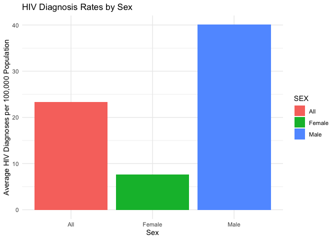

DA
================
Alice Mao
2024-12-05

``` r
# Load required libraries
library(tidyverse)
library(ggplot2)
library(broom)
```

``` r
# Load the dataset
hiv_data <- read.csv("data/HIV_AIDS_Diagnoses_by_Neighborhood__Sex__and_Race_Ethnicity_20241118.csv")

UHF <- read.csv("data/UHF_Neighborhoods.csv")
```

# Q1: How have HIV and AIDS diagnoses changed over time, and do specific neighborhoods experience disproportionately high rates?

``` r
# Clean and prepare the dataset
hiv_data <- hiv_data %>%
  mutate(
    YEAR = as.numeric(YEAR),
    Neighborhood = as.character(Neighborhood..U.H.F.), # Correct column for neighborhood
    HIV_Diagnoses = as.numeric(HIV.DIAGNOSES.PER.100.000.POPULATION),
    AIDS_Diagnoses = as.numeric(AIDS.DIAGNOSES.PER.100.000.POPULATION)
  ) %>%
  filter(YEAR >= 2016, !is.na(HIV_Diagnoses), !is.na(AIDS_Diagnoses)) # Keep only data from 2016 onwards
```

    ## Warning: There were 2 warnings in `mutate()`.
    ## The first warning was:
    ## ℹ In argument: `HIV_Diagnoses =
    ##   as.numeric(HIV.DIAGNOSES.PER.100.000.POPULATION)`.
    ## Caused by warning:
    ## ! NAs introduced by coercion
    ## ℹ Run `dplyr::last_dplyr_warnings()` to see the 1 remaining
    ##   warning.

``` r
# Aggregate HIV and AIDS diagnoses
hiv_trends <- hiv_data %>%
  group_by(YEAR, Neighborhood) %>%
  summarise(
    avg_hiv_rate = mean(HIV_Diagnoses, na.rm = TRUE),
    avg_aids_rate = mean(AIDS_Diagnoses, na.rm = TRUE)
  ) %>%
  ungroup()
```

    ## `summarise()` has grouped output by 'YEAR'. You can override
    ## using the `.groups` argument.

``` r
# Preview the aggregated data
head(hiv_trends)
```

    ## # A tibble: 6 × 4
    ##    YEAR Neighborhood                          avg_hiv_rate avg_aids_rate
    ##   <dbl> <chr>                                        <dbl>         <dbl>
    ## 1  2016 "All"                                        29.1          16.2 
    ## 2  2016 "Bayside - Little Neck"                       2.99          2.23
    ## 3  2016 "Bedford Stuyvesant -\nCrown Heights"        62.3          23.5 
    ## 4  2016 "Bensonhurst - Bay\nRidge"                   14.4           8.93
    ## 5  2016 "Borough Park"                                9.97          7.41
    ## 6  2016 "Canarsie - Flatlands"                       13.4           5.38

``` r
# Plot HIV diagnosis trends by neighborhood with a legend
ggplot(hiv_trends, aes(x = YEAR, y = avg_hiv_rate, group = Neighborhood, color = Neighborhood)) +
  geom_line(size = 0.8, alpha = 0.7) +
  labs(
    title = "Temporal Trends in HIV Diagnoses by Neighborhood (2016 Onwards)",
    x = "Year",
    y = "Average HIV Diagnoses per 100,000 Population",
    color = "Neighborhood"
  ) +
  theme_minimal() +
  theme(
    legend.position = "right", # Display the legend on the right
    plot.title = element_text(hjust = 0.5),
    legend.text = element_text(size = 8),
    legend.title = element_text(size = 10)
  )
```

<!-- -->

``` r
# Calculate the mean HIV diagnosis rate for each neighborhood
top_neighborhoods <- hiv_data %>%
  group_by(Neighborhood) %>%
  summarise(mean_hiv_rate = mean(HIV_Diagnoses, na.rm = TRUE)) %>%
  arrange(desc(mean_hiv_rate)) %>%
  slice(1:10) %>%
  pull(Neighborhood)

# Filter the dataset for the top 10 neighborhoods
filtered_hiv_data <- hiv_data %>%
  filter(Neighborhood %in% top_neighborhoods)

# Aggregate HIV diagnoses for the top 10 neighborhoods
top_hiv_trends <- filtered_hiv_data %>%
  group_by(YEAR, Neighborhood) %>%
  summarise(
    avg_hiv_rate = mean(HIV_Diagnoses, na.rm = TRUE)
  ) %>%
  ungroup()
```

    ## `summarise()` has grouped output by 'YEAR'. You can override
    ## using the `.groups` argument.

``` r
# Preview the aggregated data
head(top_hiv_trends)
```

    ## # A tibble: 6 × 3
    ##    YEAR Neighborhood                            avg_hiv_rate
    ##   <dbl> <chr>                                          <dbl>
    ## 1  2016 "Bedford Stuyvesant -\nCrown Heights"           62.3
    ## 2  2016 "Central Harlem -\nMorningside Heights"         49.1
    ## 3  2016 "Chelsea - Clinton"                             66.0
    ## 4  2016 "Crotona - Tremont"                             44.3
    ## 5  2016 "East Harlem"                                   55.5
    ## 6  2016 "East New York"                                 45.5

``` r
# Plot HIV diagnosis trends for the top 10 neighborhoods
ggplot(top_hiv_trends, aes(x = YEAR, y = avg_hiv_rate, group = Neighborhood, color = Neighborhood)) +
  geom_line(size = 1.2) +
  labs(
    title = "Temporal Trends in HIV Diagnoses for Top 10 Neighborhoods (2016 Onwards)",
    x = "Year",
    y = "Average HIV Diagnoses per 100,000 Population",
    color = "Neighborhood"
  ) +
  theme_minimal() +
  theme(
    legend.position = "right",
    legend.text = element_text(size = 10),
    legend.title = element_text(size = 12),
    plot.title = element_text(hjust = 0.5, size = 14)
  )
```

<!-- -->

``` r
# Plot AIDS diagnosis trends by neighborhood with a legend
ggplot(hiv_trends, aes(x = YEAR, y = avg_aids_rate, group = Neighborhood, color = Neighborhood)) +
  geom_line(size = 0.8, alpha = 0.7) +
  labs(
    title = "Temporal Trends in AIDS Diagnoses by Neighborhood (2016 Onwards)",
    x = "Year",
    y = "Average AIDS Diagnoses per 100,000 Population",
    color = "Neighborhood"
  ) +
  theme_minimal() +
  theme(
    legend.position = "right", # Display the legend on the right
    plot.title = element_text(hjust = 0.5),
    legend.text = element_text(size = 8),
    legend.title = element_text(size = 10)
  )
```

<!-- -->

``` r
# Calculate mean rates for each neighborhood
top_hiv_neighborhoods <- hiv_data %>%
  group_by(Neighborhood) %>%
  summarise(mean_hiv_rate = mean(HIV_Diagnoses, na.rm = TRUE)) %>%
  arrange(desc(mean_hiv_rate)) %>%
  slice(1:10) %>%
  pull(Neighborhood)

top_aids_neighborhoods <- hiv_data %>%
  group_by(Neighborhood) %>%
  summarise(mean_aids_rate = mean(AIDS_Diagnoses, na.rm = TRUE)) %>%
  arrange(desc(mean_aids_rate)) %>%
  slice(1:10) %>%
  pull(Neighborhood)

# Filter the dataset for top 10 neighborhoods
filtered_hiv_trends <- hiv_data %>%
  filter(Neighborhood %in% top_hiv_neighborhoods) %>%
  group_by(YEAR, Neighborhood) %>%
  summarise(avg_hiv_rate = mean(HIV_Diagnoses, na.rm = TRUE)) %>%
  ungroup()
```

    ## `summarise()` has grouped output by 'YEAR'. You can override
    ## using the `.groups` argument.

``` r
filtered_aids_trends <- hiv_data %>%
  filter(Neighborhood %in% top_aids_neighborhoods) %>%
  group_by(YEAR, Neighborhood) %>%
  summarise(avg_aids_rate = mean(AIDS_Diagnoses, na.rm = TRUE)) %>%
  ungroup()
```

    ## `summarise()` has grouped output by 'YEAR'. You can override
    ## using the `.groups` argument.

``` r
# Plot HIV diagnosis trends
ggplot(filtered_hiv_trends, aes(x = YEAR, y = avg_hiv_rate, group = Neighborhood, color = Neighborhood)) +
  geom_line(size = 1) +
  labs(
    title = "Temporal Trends in HIV Diagnoses (Top 10 Neighborhoods, 2016 Onwards)",
    x = "Year",
    y = "Average HIV Diagnoses per 100,000 Population",
    color = "Neighborhood"
  ) +
  theme_minimal() +
  theme(
    legend.position = "right", # Display legend
    plot.title = element_text(hjust = 0.5),
    legend.text = element_text(size = 8),
    legend.title = element_text(size = 10)
  )
```

<!-- -->

``` r
# Fit a linear regression model for year predicting HIV diagnosis rates
hiv_lm <- lm(avg_hiv_rate ~ YEAR, data = hiv_trends)

# Summarize the regression model
hiv_lm_summary <- summary(hiv_lm)

# Display regression coefficients
tidy(hiv_lm) %>%
  select(term, estimate, std.error, p.value) %>%
  mutate(p.value = format(p.value, scientific = TRUE)) %>%  # Show exact p-value in scientific notation
  knitr::kable(digits = 10)
```

| term        |    estimate |    std.error | p.value      |
|:------------|------------:|-------------:|:-------------|
| (Intercept) | 4025.661917 | 1090.0683353 | 2.708677e-04 |
| YEAR        |   -1.982152 |    0.5400386 | 2.947053e-04 |

``` r
# Identify neighborhoods with consistently high HIV diagnosis rates
high_hiv_neighborhoods <- hiv_trends %>%
  group_by(Neighborhood) %>%
  summarise(mean_hiv_rate = mean(avg_hiv_rate, na.rm = TRUE)) %>%
  arrange(desc(mean_hiv_rate)) %>%
  filter(mean_hiv_rate > quantile(mean_hiv_rate, 0.9)) # Top 10% neighborhoods

# Display the neighborhoods with high HIV rates
high_hiv_neighborhoods %>%
  knitr::kable(digits = 2)
```

| Neighborhood         | mean_hiv_rate |
|:---------------------|--------------:|
| Chelsea - Clinton    |         60.05 |
| Greenwich Village -  |               |
| Soho                 |         48.94 |
| Hunts Point - Mott   |               |
| Haven                |         47.29 |
| Crotona - Tremont    |         43.47 |
| Bedford Stuyvesant - |               |
| Crown Heights        |         40.33 |

``` r
tidy(hiv_lm) %>%
  select(term, estimate, std.error, p.value) %>%
  mutate(p.value = format(p.value, scientific = TRUE)) %>%  # Show exact p-value in scientific notation
  knitr::kable(digits = 10)
```

| term        |    estimate |    std.error | p.value      |
|:------------|------------:|-------------:|:-------------|
| (Intercept) | 4025.661917 | 1090.0683353 | 2.708677e-04 |
| YEAR        |   -1.982152 |    0.5400386 | 2.947053e-04 |

Conclusion:

The analysis of temporal trends in HIV diagnoses demonstrates a
significant downward trend in diagnosis rates from 2016 onward. The
linear regression model revealed a slope of -1.982, indicating an
average annual decrease of approximately 1.98 HIV diagnoses per 100,000
population. The p-value for the `YEAR` variable was lower than 0.05,
indicating a statistically significant evidence against the null
hypothesis and confirming that the observed trend is not due to random
variation. However, neighborhood-level disparities remain a significant
concern. Analysis of outlier neighborhoods highlighted that certain
areas consistently reported significantly higher HIV diagnosis rates.

# Q2:

``` r
# Group by sex and calculate average HIV diagnoses
hiv_by_sex <- hiv_data %>%
  group_by(SEX) %>%
  summarise(avg_hiv_rate = mean(HIV_Diagnoses, na.rm = TRUE)) %>%
  arrange(desc(avg_hiv_rate))

# Group by race/ethnicity and calculate average HIV diagnoses
hiv_by_race <- hiv_data %>%
  group_by(RACE.ETHNICITY) %>%
  summarise(avg_hiv_rate = mean(HIV_Diagnoses, na.rm = TRUE)) %>%
  arrange(desc(avg_hiv_rate))

# Display the summaries
hiv_by_sex %>%
  knitr::kable(digits = 2, caption = "Average HIV Diagnosis Rates by Sex")
```

| SEX    | avg_hiv_rate |
|:-------|-------------:|
| Male   |        40.07 |
| All    |        23.29 |
| Female |         7.62 |

Average HIV Diagnosis Rates by Sex

``` r
hiv_by_race %>%
  knitr::kable(digits = 2, caption = "Average HIV Diagnosis Rates by Race/Ethnicity")
```

| RACE.ETHNICITY  | avg_hiv_rate |
|:----------------|-------------:|
| Black           |        54.93 |
| Latino/Hispanic |        28.41 |
| All             |        21.89 |
| Other/Unknown   |        14.97 |
| White           |        12.28 |
| Asian/Pacific   |              |
| Islander        |         9.30 |

Average HIV Diagnosis Rates by Race/Ethnicity

``` r
# Bar plot for HIV diagnosis rates by sex
ggplot(hiv_by_sex, aes(x = SEX, y = avg_hiv_rate, fill = SEX)) +
  geom_bar(stat = "identity") +
  labs(
    title = "HIV Diagnosis Rates by Sex",
    x = "Sex",
    y = "Average HIV Diagnoses per 100,000 Population"
  ) +
  theme_minimal()
```

<!-- -->

``` r
# Bar plot for HIV diagnosis rates by race/ethnicity
ggplot(hiv_by_race, aes(x = reorder(RACE.ETHNICITY, avg_hiv_rate), y = avg_hiv_rate, fill = RACE.ETHNICITY)) +
  geom_bar(stat = "identity") +
  coord_flip() + # Flip for better readability
  labs(
    title = "HIV Diagnosis Rates by Race/Ethnicity",
    x = "Race/Ethnicity",
    y = "Average HIV Diagnoses per 100,000 Population"
  ) +
  theme_minimal() +
  theme(legend.position = "none")
```

<!-- -->

``` r
# Fit a linear regression model for HIV diagnosis rates
hiv_lm <- lm(HIV_Diagnoses ~ SEX + RACE.ETHNICITY, data = hiv_data)

# Summarize the regression model
hiv_lm_summary <- summary(hiv_lm)

# Display regression coefficients
tidy(hiv_lm) %>%
  select(term, estimate, std.error, p.value) %>%
  mutate(p.value = format(p.value, scientific = TRUE)) %>%
  knitr::kable(digits = 3, caption = "Linear Regression: Predicting HIV Diagnoses")
```

| term                          | estimate | std.error | p.value       |
|:------------------------------|---------:|----------:|:--------------|
| (Intercept)                   |   21.537 |     1.129 | 7.275877e-79  |
| SEXFemale                     |  -15.674 |     0.977 | 1.064319e-56  |
| SEXMale                       |   16.746 |     0.978 | 3.474420e-64  |
| RACE.ETHNICITYAsian/Pacific   |          |           |               |
| Islander                      |  -12.565 |     1.383 | 1.364801e-19  |
| RACE.ETHNICITYBlack           |   33.035 |     1.382 | 1.065960e-120 |
| RACE.ETHNICITYLatino/Hispanic |    6.513 |     1.382 | 2.506124e-06  |
| RACE.ETHNICITYOther/Unknown   |   -6.854 |     1.384 | 7.514098e-07  |
| RACE.ETHNICITYWhite           |   -9.611 |     1.382 | 3.951311e-12  |

Linear Regression: Predicting HIV Diagnoses

``` r
# Fit a multivariate regression model adjusting for year and neighborhood
hiv_multivariate_lm <- lm(HIV_Diagnoses ~ SEX + RACE.ETHNICITY + YEAR + Neighborhood..U.H.F., data = hiv_data)

# Summarize the multivariate regression model
tidy(hiv_multivariate_lm) %>%
  select(term, estimate, std.error, p.value) %>%
  mutate(p.value = format(p.value, scientific = TRUE)) %>%
  knitr::kable(digits = 10, caption = "Multivariate Regression: Adjusting for Confounders")
```

| term | estimate | std.error | p.value |
|:---|---:|---:|:---|
| (Intercept) | 4432.71461404 | 449.3360454 | 8.795901e-23 |
| SEXFemale | -15.68201860 | 0.9077399 | 2.675863e-65 |
| SEXMale | 16.77128266 | 0.9084285 | 4.601996e-74 |
| RACE.ETHNICITYAsian/Pacific |  |  |  |
| Islander | -12.53216867 | 1.2842262 | 2.485694e-22 |
| RACE.ETHNICITYBlack | 33.03541667 | 1.2835774 | 1.224881e-138 |
| RACE.ETHNICITYLatino/Hispanic | 6.51319444 | 1.2835774 | 4.007529e-07 |
| RACE.ETHNICITYOther/Unknown | -6.80542575 | 1.2852104 | 1.231332e-07 |
| RACE.ETHNICITYWhite | -9.61061508 | 1.2835774 | 8.042352e-14 |
| YEAR | -2.18592344 | 0.2225841 | 1.357711e-22 |
| Neighborhood..U.H.F.Bayside - Little Neck | -19.20383598 | 2.7728440 | 4.792543e-12 |
| Neighborhood..U.H.F.Bedford Stuyvesant - |  |  |  |
| Crown Heights | 16.44298942 | 2.7728440 | 3.198223e-09 |
| Neighborhood..U.H.F.Bensonhurst - Bay |  |  |  |
| Ridge | -10.85383598 | 2.7728440 | 9.165992e-05 |
| Neighborhood..U.H.F.Borough Park | -11.53240741 | 2.7728440 | 3.240344e-05 |
| Neighborhood..U.H.F.Canarsie - Flatlands | -7.90859788 | 2.7728440 | 4.357176e-03 |
| Neighborhood..U.H.F.Central Harlem - |  |  |  |
| Morningside Heights | 13.92870370 | 2.7728440 | 5.227528e-07 |
| Neighborhood..U.H.F.Chelsea - Clinton | 37.79933862 | 2.7728440 | 1.077335e-41 |
| Neighborhood..U.H.F.Coney Island - |  |  |  |
| Sheepshead Bay | -8.42843915 | 2.7728440 | 2.378862e-03 |
| Neighborhood..U.H.F.Crotona - Tremont | 20.02632275 | 2.7728440 | 5.746986e-13 |
| Neighborhood..U.H.F.Downtown - Heights - |  |  |  |
| Park Slope | -5.12208995 | 2.7728440 | 6.476261e-02 |
| Neighborhood..U.H.F.East Flatbush - |  |  |  |
| Flatbush | 7.24298942 | 2.7728440 | 9.020841e-03 |
| Neighborhood..U.H.F.East Harlem | 13.86283069 | 2.7728440 | 5.911480e-07 |
| Neighborhood..U.H.F.East New York | 13.60568783 | 2.7728440 | 9.504068e-07 |
| Neighborhood..U.H.F.Flushing - Clearview | -6.32843915 | 2.7728440 | 2.250702e-02 |
| Neighborhood..U.H.F.Fordham - Bronx |  |  |  |
| Park | 5.12235450 | 2.7728440 | 6.474879e-02 |
| Neighborhood..U.H.F.Fresh Meadows | -12.24431217 | 2.7728440 | 1.024087e-05 |
| Neighborhood..U.H.F.Gramercy Park - |  |  |  |
| Murray Hill | 2.72949735 | 2.7728440 | 3.249746e-01 |
| Neighborhood..U.H.F.Greenpoint | -3.84748677 | 2.7728440 | 1.653228e-01 |
| Neighborhood..U.H.F.Greenwich Village - |  |  |  |
| Soho | 26.99457672 | 2.7728440 | 3.112492e-22 |
| Neighborhood..U.H.F.High Bridge - |  |  |  |
| Morrisania | 15.97314815 | 2.7728440 | 8.800065e-09 |
| Neighborhood..U.H.F.Hunts Point - Mott |  |  |  |
| Haven | 22.19158295 | 2.8216877 | 4.359583e-15 |
| Neighborhood..U.H.F.Jamaica | -4.85621693 | 2.7728440 | 7.993703e-02 |
| Neighborhood..U.H.F.Kingsbridge - |  |  |  |
| Riverdale | -10.76335979 | 2.7728440 | 1.048418e-04 |
| Neighborhood..U.H.F.Long Island City - |  |  |  |
| Astoria | 6.80886243 | 2.7728440 | 1.409505e-02 |
| Neighborhood..U.H.F.Lower Manhattan | 4.43902116 | 2.7728440 | 1.094538e-01 |
| Neighborhood..U.H.F.Northeast Bronx | -6.00304233 | 2.7728440 | 3.043161e-02 |
| Neighborhood..U.H.F.Pelham - Throgs |  |  |  |
| Neck | 0.05886243 | 2.7728440 | 9.830643e-01 |
| Neighborhood..U.H.F.Port Richmond | -3.28889912 | 2.7919938 | 2.388533e-01 |
| Neighborhood..U.H.F.Ridgewood - Forest |  |  |  |
| Hills | 3.78822751 | 2.7728440 | 1.719311e-01 |
| Neighborhood..U.H.F.Rockaway | -8.49748677 | 2.7728440 | 2.189761e-03 |
| Neighborhood..U.H.F.South Beach - |  |  |  |
| Tottenville | -3.34589947 | 2.7728440 | 2.276081e-01 |
| Neighborhood..U.H.F.Southeast Queens | -10.25383598 | 2.7728440 | 2.192931e-04 |
| Neighborhood..U.H.F.Southwest Queens | -6.01574074 | 2.7728440 | 3.008242e-02 |
| Neighborhood..U.H.F.Stapleton - St. |  |  |  |
| George | -6.96177249 | 2.7728440 | 1.207542e-02 |
| Neighborhood..U.H.F.Sunset Park | 2.23743386 | 2.7728440 | 4.197507e-01 |
| Neighborhood..U.H.F.Union Square - |  |  |  |
| Lower East Side | 2.01759259 | 2.7728440 | 4.668712e-01 |
| Neighborhood..U.H.F.Upper East Side | -4.82526455 | 2.7728440 | 8.187771e-02 |
| Neighborhood..U.H.F.Upper West Side | -1.96256614 | 2.7728440 | 4.791088e-01 |
| Neighborhood..U.H.F.Washington Heights - |  |  |  |
| Inwood | 12.10171958 | 2.7728440 | 1.296321e-05 |
| Neighborhood..U.H.F.West Queens | -3.03796296 | 2.7728440 | 2.732924e-01 |
| Neighborhood..U.H.F.Williamsburg - |  |  |  |
| Bushwick | 10.82473545 | 2.7728440 | 9.571857e-05 |
| Neighborhood..U.H.F.Willowbrook | -7.48161376 | 2.7728440 | 6.991656e-03 |

Multivariate Regression: Adjusting for Confounders

Conclusion:

The analysis of demographic disparities in HIV diagnoses revealed
significant differences across sex and race/ethnicity. The linear
regression model identified males as having significantly higher HIV
diagnosis rates than females, with a coefficient of 16.771 for
`SEXMale`. The p-value for this variable was lower than 0.05, providing
strong statistical evidence that sex is a significant predictor of HIV
diagnoses.

Race and ethnicity were also found to be highly significant predictors.
The coefficients for `RACE.ETHNICITYBlack` (33.035) and
`RACE.ETHNICITYLatino/Hispanic` (6.513) highlight disproportionately
high HIV diagnosis rates among Black and Hispanic populations. The
near-zero p-values for these predictors confirm that the observed
disparities are not due to random variation. These findings align with
existing evidence that systemic inequities, including barriers to
healthcare access, economic instability, and stigma, disproportionately
affect these groups.

The multivariate regression model, adjusting for confounders such as
year and neighborhood, confirmed the robustness of these disparities.
Even after controlling for these factors, the p-values for sex and
race/ethnicity remained small, showing that these disparities are deeply
rooted in structural and systemic inequities rather than purely
geographic or temporal differences.
