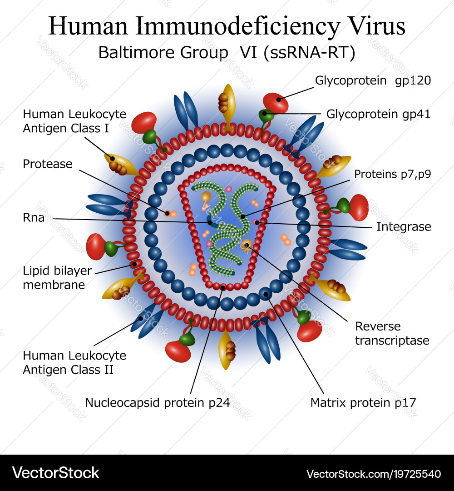

---------------------------------

## Introduction

HIV (Human Immunodeficiency Virus) is a virus that attacks the body’s immune system, specifically targeting CD4 cells (T cells), which are crucial for fighting infections. If left untreated, HIV can weaken the immune system over time, leading to AIDS (Acquired Immunodeficiency Syndrome), the most severe stage of the virus. HIV is primarily transmitted through blood, semen, vaginal and rectal fluids, and breast milk, often via unprotected sex, sharing needles, or mother-to-child transmission during childbirth or breastfeeding. While there is no cure, effective antiretroviral therapy (ART) can suppress the virus to undetectable levels, preventing disease progression and reducing transmission. With proper treatment and preventive measures like PrEP, HIV is now a manageable chronic condition, allowing individuals to live long, healthy lives.

```{r, echo=FALSE, out.width='50%', fig.align='center'}

```

Understanding the distribution of HIV among racial groups in different areas of New York City is crucial for addressing health disparities and promoting social equity. Differences in HIV rates across racial and geographic lines often highlight deeper issues, such as socioeconomic inequality, limited access to healthcare, and systemic discrimination. By identifying the most affected communities, this research provides valuable insights for designing targeted prevention and treatment strategies that meet the specific needs of high-risk populations. Ultimately, these efforts aim to reduce health inequities and improve public health outcomes throughout the city.

---------------------------------

## Distribution Map

```{r, include=FALSE}
# Load packages
library(tidygeocoder)
library(dplyr)
library(leaflet)
```

```{r, message=FALSE}
# Load your CSV data
df_uhf <- read.csv("./data/Merged_HIV_UHF_Data.csv")

# Add full address for geocoding
df_uhf <- df_uhf |> 
  mutate(full_address = paste(neighborhood_u_h_f, "New York, USA", sep = ", "))

# Perform geocoding
df_uhf_geo <- df_uhf |> 
  geocode(address = full_address, method = "osm", full_results = FALSE)

# Filter results to NYC bounds
df_uhf_geo <- df_uhf_geo |> 
  filter(lat >= 40.4774 & lat <= 40.9176 & long >= -74.2591 & long <= -73.7004)


leaflet(df_uhf_geo) |> 
  addProviderTiles(providers$CartoDB.Positron) |> 
  setView(lng = -73.935242, lat = 40.730610, zoom = 11) |> 
  
# Add HIV Diagnoses layer
addCircleMarkers(
  lng = ~long, lat = ~lat,
  radius = ~sqrt(hiv_diagnoses_per_100_000_population) / 2,  # Adjust radius based on HIV data
  label = ~paste("Neighborhood:", neighborhood_u_h_f, "<br>",
                 "HIV Diagnoses:", hiv_diagnoses_per_100_000_population),  # Multi-line label
  popup = ~paste("Neighborhood:", neighborhood_u_h_f, "<br>",
                 "Code:", uhf_label, "<br>",
                 "HIV Diagnoses per 100,000 Population:", hiv_diagnoses_per_100_000_population),
  color = "red",  # Set color for HIV data
  fillOpacity = 0.7,
  group = "HIV Diagnoses"  # Add group for layer control
  ) |> 
  
# Add AIDS Diagnoses layer
addCircleMarkers(
  lng = ~long, lat = ~lat,
  radius = ~sqrt(aids_diagnoses_per_100_000_population) / 2,  # Adjust radius based on AIDS data
  label = ~paste("Neighborhood:", neighborhood_u_h_f, "<br>",
                 "AIDS Diagnoses:", aids_diagnoses_per_100_000_population),  # Multi-line label
  popup = ~paste("Neighborhood:", neighborhood_u_h_f, "<br>",
                 "Code:", uhf_label, "<br>",
                 "AIDS Diagnoses per 100,000 Population:", aids_diagnoses_per_100_000_population),
  color = "blue",  # Set color for AIDS data
  fillOpacity = 0.7,
  group = "AIDS Diagnoses"  # Add group for layer control
  ) |> 
  
# Add layer controls for toggling between datasets
addLayersControl(
  overlayGroups = c("HIV Diagnoses", "AIDS Diagnoses"),  # Specify layer groups
  options = layersControlOptions(collapsed = FALSE)  # Keep control panel open
  )
```


---------------------------------

## Screencast


