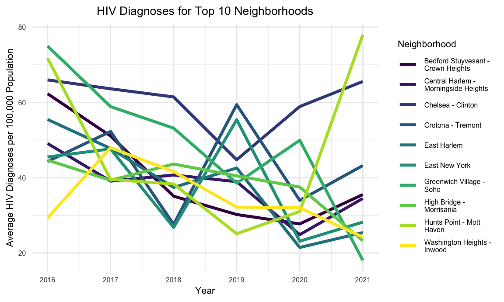
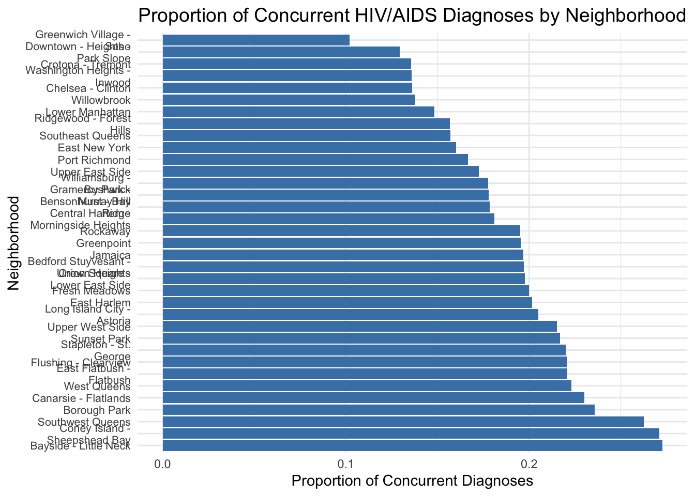

---------------------------------

## Motivation 

Our project aims to address the critical public health challenge of HIV by understanding its distribution among racial groups in New York City. December 1, designated as World AIDS Day by the WHO, underscores the urgency of raising awareness and preventing the spread of HIV (HIV can progress to AIDS if left untreated). By identifying the most affected communities, we seek to uncover systemic issues like socioeconomic inequality and healthcare access disparities, guiding targeted interventions to reduce health inequities and promote social equity.

---------------------------------

## Related work 

Our inspiration stems from an article by the Associated Press titled “A twice-yearly shot could help end AIDS. But will it get to everyone who needs it?” This article highlights the groundbreaking potential of a twice-yearly injection for HIV prevention while shedding light on the persistent challenges of equitable access and affordability. Recognizing that systemic disparities in healthcare access, particularly among marginalized groups and regions like Latin America, hinder the global fight against HIV/AIDS, we were motivated to delve deeper into the trends and disparities in HIV/AIDS diagnoses. Our research aims to uncover the current status of progress in HIV/AIDS prevention, contributing to a better understanding of where interventions are most needed to promote global health equity in United States.

Link "https://apnews.com/article/hiv-infections-aids-prevention-shot-02606f7d7892f0baf55bd0a0ff2ba3de"

---------------------------------

## Initial questions 

The purposes of this project is to answer the following questions: 

1. Temporal Trends: How have HIV and AIDS diagnoses changed over time, and do specific neighborhoods experience disproportionately high rates?

2. Demographic Disparities: Are there significant disparities in HIV/AIDS diagnoses across sex and race/ethnicity?

3. Concurrent Diagnoses: Do concurrent HIV/AIDS diagnoses (late diagnoses) differ significantly across neighborhoods, and are these patterns influenced by other factors like race/ethnicity?

---------------------------------

## Data 

Our dataset was downloaded from [NYC Open Data](https://data.cityofnewyork.us/Health/HIV-AIDS-Diagnoses-by-Neighborhood-Sex-and-Race-Et/ykvb-493p/about_data), a platform that provides access to data shared by New York City's government agencies. It provides information on new HIV and AIDS diagnoses in New York City, reported to the NYC Department of Health and Mental Hygiene (DOHMH) by March 31, 2021. It includes data from the calendar years 2016 through 2021, detailing both the number of cases and case rates per 100,000 population. The data is stratified by United Hospital Fund (UHF) neighborhood, sex, and race/ethnicity.

To obtain a dataset containing valid spatial geometries for New York City's United Hospital Fund (UHF) neighborhoods, [shapefiles](https://www.nyc.gov/site/doh/data/data-sets/maps-gis-data-files-for-download.page) provided by the NYC Department of Health and Mental Hygiene (DOHMH) were used. These shapefiles delineate UHF boundaries, making them suitable for geographic analyses and mapping. The process involved downloading the "United Hospital Fund Boundaries" shapefile from the NYC DOHMH GIS Data Files page, extracting the ZIP file to access its components (.shp, .shx, .dbf, .prj), and ensuring the UHF codes matched those in the HIV dataset. This preparation allowed accurate merging and mapping of HIV data with UHF geography for further analysis and visualization.

---------------------------------

## Exploratory analysis 

Our analysis including the following:

### Temporal trends of HIV diagnoses

We began to explore the trends of HIV diagnoses from 2016 to 2021 in NYC. We try to look at the trend on a large scale so that we can have an initial judgement conclusion.Then, we tried to look at AIDS diagnosis trends in different parts of New York City with the same scope.


The Bronx consistently has the highest HIV diagnosis rates, with a decline between 2016 and 2018 followed by a rebound that peaked in 2021, likely driven by socio-economic challenges and healthcare access issues. In contrast, Staten Island has the lowest rates, with a sharp decline from 2016 to 2017 before stabilizing, suggesting effective interventions or a smaller population base. While most boroughs show declining or stabilizing trends, the Bronx's increasing rates underscore significant disparities and the urgent need for targeted, borough-specific strategies.

### Temporal trends of AID diagnoses


The Bronx experienced a dramatic spike in HIV diagnoses in 2021, reversing a declining trend from 2016 to 2019. This sharp increase suggests systemic issues such as delayed diagnoses, treatment interruptions, or lack of timely access to antiretroviral therapy (ART). In contrast, Staten Island's HIV diagnosis rates remain consistently low, similar to Queens, with only a slight increase from 2020 to 2021, warranting further investigation despite remaining well below rates in the Bronx and Manhattan.


### HIV Diagnoses by Sex and Race/Ethnicity

After looking at the region, we wanted to see if there were significant differences in HIV diagnoses by race and gender, which could help us make better predictions and improvements in health care and the community.


Black populations have the highest HIV diagnosis rates, followed by Latino/Hispanic populations, while Asian/Pacific Islander and White groups consistently show the lowest rates, highlighting stark racial disparities. Males across all racial/ethnic groups have higher diagnosis rates than females, particularly Black and Latino/Hispanic males, who show significant outliers, indicating areas requiring focused interventions. Although females have lower overall rates, Black females face notable disparities compared to other groups. These patterns underscore systemic inequities in access to prevention, testing, and treatment, with Black and Latino/Hispanic populations requiring prioritized healthcare services and interventions.


### Proportion of concurrent diagnoses by neighborhood

It is worth mentioning that we have the same interest in the complications of HIV, which can help people to better understand such conditions.


Within the same borough, concurrent HIV/AIDS diagnosis rates vary widely across neighborhoods, with certain areas in Brooklyn (e.g., Bedford-Stuyvesant) and Manhattan (e.g., Greenwich Village, Chelsea) showing exceptionally high rates, often exceeding 150%, while Staten Island and Queens maintain lower percentages. These outliers in Brooklyn and Manhattan suggest structural challenges related to healthcare access, awareness, or socio-economic factors. Community-level disparities emphasize the role of localized healthcare infrastructure and socio-economic conditions. The high rate of concurrent diagnoses reflects late HIV detection, often when patients have progressed to AIDS, highlighting an urgent need for earlier testing and intervention efforts.


### Proportion of Concurrent Diagnoses by Sex


The proportion of concurrent diagnoses varies widely across boroughs, with Staten Island having the highest overall rate, particularly among females, which stands out as a significant outlier warranting further investigation. Queens also shows a relatively high proportion among females, while other boroughs display a more balanced distribution. The Bronx, despite its high HIV prevalence, demonstrates relatively balanced proportions, suggesting effective early detection and treatment efforts. Most boroughs exhibit higher rates among males, aligning with data on delayed diagnoses among men, especially men who have sex with men (MSM).

### Proportion of Concurrent Diagnoses by Race/Ethnicity


Asian/Pacific Islanders in the Bronx have the highest rates of concurrent diagnoses, surpassing all other racial/ethnic groups across boroughs. Staten Island also exhibits very high rates among Whites and the Other/Unknown category, with similar trends in Queens. Black and Latino/Hispanic populations show consistent proportions across boroughs but remain highest in the Bronx. Brooklyn and Queens have notably lower percentages of Asian/Pacific Islanders compared to the Bronx. High rates in specific groups in the Bronx and Staten Island likely reflect delayed diagnoses or systemic barriers such as limited access to care, stigma, or socioeconomic challenges. Overrepresentation of Other/Unknown racial groups suggests potential data limitations or gaps.


---------------------------------


## Data Analysis

###  How have HIV and AIDS diagnoses changed over time, and do specific neighborhoods experience disproportionately high rates?




Our group first examined whether there were any significant trends in HIV diagnoses in New York from 2016 to 2021. We then filtered out the top 10 neighborhoods with the highest number of HIV diagnoses.


Following the analysis of HIV, we also examined the trends in AIDS diagnoses. By comparison, the trends for HIV and AIDS diagnoses are similar.

```{r}
tidy(hiv_lm) %>%
  select(term, estimate, std.error, p.value) %>%
  mutate(p.value = format(p.value, scientific = TRUE)) %>%  # Show exact p-value in scientific notation
  knitr::kable(digits = 10)
```


The analysis of temporal trends in HIV diagnoses demonstrates a significant downward trend in diagnosis rates from 2016 onward. The linear regression model revealed a slope of -1.982, indicating an average annual decrease of approximately 1.98 HIV diagnoses per 100,000 population. The p-value for the `YEAR` variable was lower than 0.05, indicating a statistically significant evidence against the null hypothesis and confirming that the observed trend is not due to random variation. However, neighborhood-level disparities remain a significant concern. Analysis of outlier neighborhoods highlighted that certain areas consistently reported significantly higher HIV diagnosis rates.

### Are there significant disparities in HIV/AIDS diagnoses across sex and race/ethnicity?


This section focuses on demographic disparities. The graph shows a high proportion of HIV diagnoses among Black and Latino/Hispanic individuals."


This section focuses on demographic disparities. The graph shows a high proportion of HIV diagnoses among Black and Latino/Hispanic individuals.

```{r}
tidy(hiv_lm_2) %>%
  select(term, estimate, std.error, p.value) %>%
  mutate(p.value = format(p.value, scientific = TRUE)) %>%
  knitr::kable(digits = 3, caption = "Linear Regression: Predicting HIV Diagnoses")

```

The linear regression analysis of demographic disparities in HIV diagnoses revealed significant differences across sex and race/ethnicity. The linear regression model identified males as having significantly higher HIV diagnosis rates than females, with a coefficient of 16.771 for `SEXMale`. The p-value for this variable was lower than 0.05, providing strong statistical evidence that sex is a significant predictor of HIV diagnoses.

Race and ethnicity were also found to be highly significant predictors. The coefficients for `RACE.ETHNICITYBlack` (33.035) and `RACE.ETHNICITYLatino/Hispanic` (6.513) highlight disproportionately high HIV diagnosis rates among Black and Hispanic populations. The near-zero p-values for these predictors confirm that the observed disparities are not due to random variation. These findings align with existing evidence that systemic inequities, including barriers to healthcare access, economic instability, and stigma, disproportionately affect these groups.

```{r}
# Summarize the multivariate regression model
tidy(hiv_multivariate_lm) %>%
  select(term, estimate, std.error, p.value) %>%
  mutate(p.value = format(p.value, scientific = TRUE)) %>%
  knitr::kable(digits = 10, caption = "Multivariate Regression: Adjusting for Confounders")
```

The multivariate regression model, adjusting for confounders such as year and neighborhood, confirmed the robustness of these disparities. Even after controlling for these factors, the p-values for sex and race/ethnicity remained small, showing that these disparities are deeply rooted in structural and systemic inequities rather than purely geographic or temporal differences.

### What is the proportion of concurrent HIV/AIDS diagnoses among total HIV diagnoses, and how does this vary by neighborhood and demographic group?



Conclusion:

Based on the analysis of the proportion of concurrent HIV/AIDS diagnoses among total HIV diagnoses, significant variation is observed across neighborhoods and demographic groups. In the first visualization, the breakdown by neighborhoods reveals that certain areas, such as Bayside-Little Neck and Sheepshead Bay, exhibit the highest proportions of concurrent diagnoses, while neighborhoods like Greenwich Village - Soho and Downtown-Heights Park Slope have the lowest proportions. This suggests that disparities in early diagnosis and access to healthcare may be geographically distributed.

The second visualization adds a demographic lens, highlighting disparities among race/ethnicity and gender groups within neighborhoods. Across all groups, the proportion of concurrent diagnoses tends to be higher in marginalized communities, particularly among Black and Latino/Hispanic populations. Furthermore, gender differences reveal that females generally experience higher proportions of concurrent diagnoses compared to males, indicating potential gender-specific barriers to timely HIV testing and care.

These findings underscore the critical need for targeted public health interventions aimed at improving early HIV detection and reducing disparities across neighborhoods and demographic groups. Addressing structural barriers, increasing awareness, and enhancing access to care in underserved areas are essential steps to ensure equitable health outcomes for all populations.


---------------------------------

## Discussion

HIV diagnosis rates have fallen significantly since 2016, averaging 1.98 fewer cases per 100,000 people per year, reflecting progress in prevention efforts and access to care. However, diagnosis rates remain disproportionately high in communities like the Bronx and Brooklyn, pointing to systemic barriers such as poverty, limited access to care, and stigma. Men, especially men who have sex with men (MSM), as well as Black and Latino/Hispanic populations, are diagnosed at significantly higher rates than other groups, highlighting the need for outreach and testing targeting these high-risk populations. Additionally, higher rates of concurrent HIV/AIDS diagnoses, particularly in Staten Island and certain urban communities, reflect late detection and treatment delays that need to be addressed through expanded testing and improved access to timely treatment.

Final Thoughts:
While progress has been made in reducing overall HIV diagnosis rates, significant demographic and geographic disparities persist, underscoring systemic and structural challenges that must be addressed. These findings highlight the importance of an equity-oriented approach to HIV prevention and treatment. Ensuring that all populations have access to timely, appropriate, and comprehensive care is critical to further reducing HIV infection rates and addressing these disparities. Specific interventions should include community-based education, awareness, and testing campaigns targeting high-risk communities such as the Bronx and Brooklyn. Efforts must also expand access to PrEP, testing, and antiretroviral therapy for Black and Latino/Hispanic populations, as well as men (especially MSM), who are most at risk. Finally, reducing stigma, improving healthcare access, and addressing socioeconomic determinants of health through policy and resource allocation should remain priorities.
